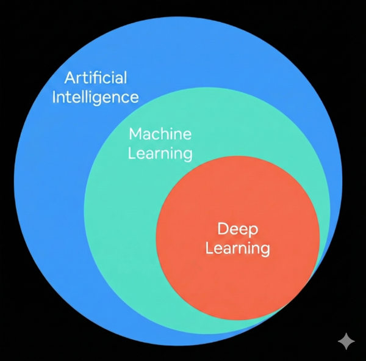
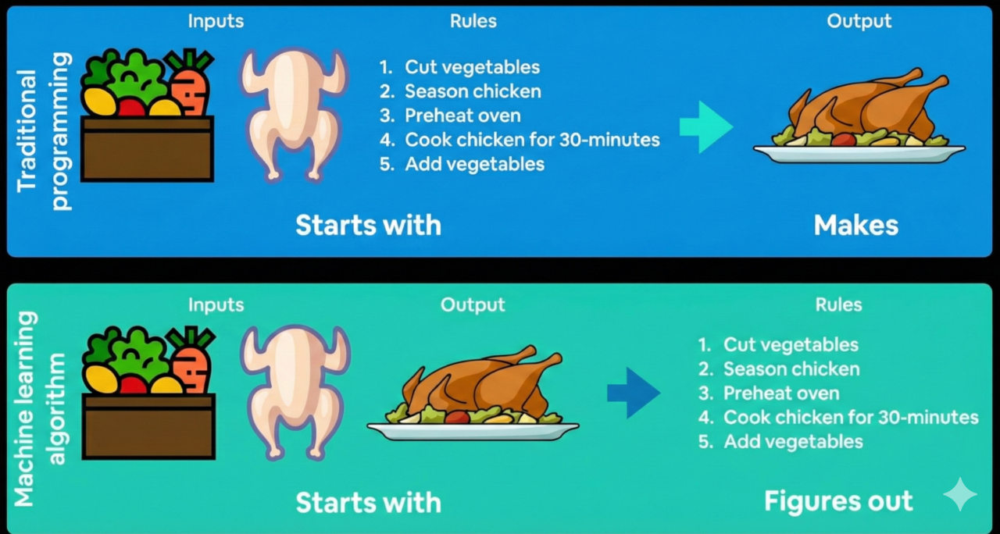

### **1. What is Machine Learning?**

- **Machine Learning (ML)** is about converting **data** (images, text, numbers, audio, etc.) into **numbers** and finding **patterns** in them.
- This pattern recognition is done by **machine learning algorithms**, which involve **code and math**.

### **2. AI, Machine Learning, and Deep Learning**

- **Artificial Intelligence (AI)**: The broadest category.
- **Machine Learning (ML)**: A subset of AI that focuses on pattern recognition.
- **Deep Learning (DL)**: A subset of ML that uses **neural networks** to learn complex patterns.
- **PyTorch** can be used for both **ML and DL**.

### **3. Traditional Programming vs. Machine Learning**

#### **Traditional Programming Approach**

- The programmer **writes explicit rules** to transform inputs into outputs.
- Example: Cooking a roast chicken using step-by-step instructions.

#### **Machine Learning Approach**

- Instead of writing rules manually, the algorithm **learns** from examples.
- It identifies the relationships between **inputs (features)** and **outputs (labels)**.
- This is called **Supervised Learning** when input-output pairs are provided.

### **Supervised Learning**

- **Features (Inputs)**: The data given to the algorithm (e.g., ingredients in a recipe).
- **Labels (Outputs)**: The correct answer the algorithm is supposed to learn (e.g., the final dish).
- **Algorithm's Goal**: Learn the relationship between features and labels. It **analyzes multiple examples** of input-output pairs and finds **patterns** that allow it to predict the correct output when given new inputs.

### **Why Use Machine Learning?**

- Traditional programming requires **explicitly defining** every rule (e.g., recognizing handwritten text, detecting objects in images). Some tasks, like **self-driving cars**, involve **too many rules** to write manually.
- Machine learning can **generalize and automate** rule discovery.
- Consider: **When would writing rules manually become too complex?**
  - Example: **Spam detection in emails** → Writing explicit rules for every spam variation is impossible, but a machine learning model can learn from past examples and recognize patterns in spam messages.
  - Example: **Self-driving cars** → Instead of writing rules for every possible driving scenario, a machine learning model learns from real-world driving data.
- **Google’s #1 Rule of Machine Learning:**
  - If a simple set of rules can solve the problem, **use rules instead of ML**.
